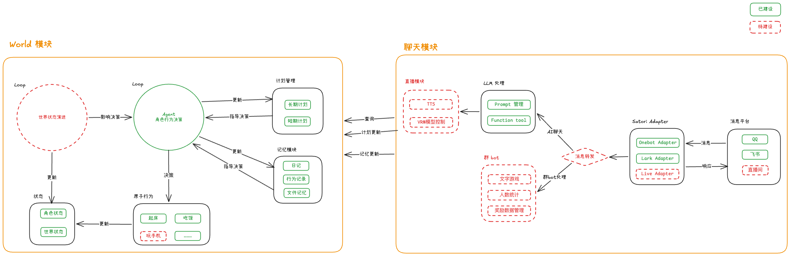

# ゆいじゅ（悠酱）

  

幻想打造一个 ゆいじゅ 生活的世界。

# 项目介绍

这是一个 LLM 驱动的「角色自主生活模拟」项目，也可以算是 AI 伙伴，让一个角色在持续推进的世界里，基于自身状态与环境信息进行决策、执行行为，并留下可追溯的生活轨迹。目标是构建一个鲜活的角色。

> philosophy: 不做 AI 智能助手，做有自己生活的“人”

飞书文档🔗 [yuiju 项目介绍](https://my.feishu.cn/docx/EPmhd2SwmoPSjoxnmAGc9T7TnSb)

[Bilibili 视频](https://www.bilibili.com/video/BV1fRR2BYEb1)

## 特性

- **通过QQ/飞书聊天：** 支持私聊与群聊
- **像游戏一样构建角色生活：** 项目用地点、时间、天气、状态和事件构建虚拟世界，让角色在其中吃饭、上学、散步、打工、做饭和休息；角色的近况与回复来自自己的生活经历，而不是每次被问起时临时现编。
- **动态天气系统：** 世界会有天气变化，天气会成为角色生活和表达的一部分，让日常不只是固定脚本。
- **日记与回忆：** 角色可以根据自己的经历整理日记，让“记得今天”变成具体内容。
- **计划与目标：** 角色可以拥有长期和短期计划，不只是被动回应用户的当下输入。
- **自然主动分享：** 当生活里发生值得说的事时，角色可以在合适的时候主动分享，而不是永远等用户开口。

# Get Started

[部署文档](./docs/onboarding.md)
[Docker 一键部署（单镜像）](./docs/docker-one-click.md)

# Architecture

# 相关文档

项目目前处于早期开发阶段，文档建设比较少，详细内容可以问 AI（呜呜）。

每个子应用内可能有自己的 READEME.md 文件
