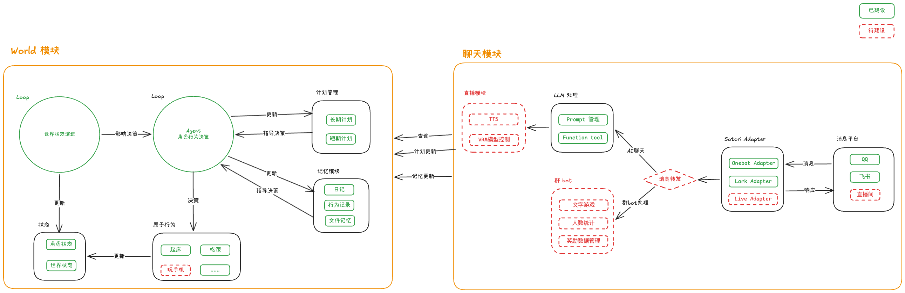

<p align="center">
  
</p>

<h1 align="center">Yuiju</h1>

<p align="center">
  <strong>让角色拥有自己的生活</strong>
</p>

<p align="center">
  一个由 LLM 驱动、在持续世界中自主生活的虚拟角色项目。
</p>

<p align="center">
  <a href="https://yuiju-site.yixiaojiu.top/">项目文档</a>
  ·
  <a href="https://yuiju-web.yixiaojiu.top">在线体验</a>
  ·
  <a href="https://yuiju-site.yixiaojiu.top/deployment/docker">开始部署</a>
  ·
  <a href="https://www.bilibili.com/video/BV1fRR2BYEb1">演示视频</a>
</p>

<p align="center">
  <a href="./LICENSE">
    
  </a>
</p>

## Yuiju 是什么

Yuiju 不是一个以问答和任务执行为中心的 AI 助手。它尝试构建一个有自己生活的虚拟角色：角色会感知时间、天气、地点和自身状态，自主选择并执行行为，逐渐形成连续的经历、记忆、日记和计划。

用户可以通过 QQ、飞书和 Web 观察或介入角色的生活。聊天只是彼此相遇的窗口；角色的近况、回复和主动分享，来自她在世界里真正经历过的事情。

> 不做 AI 智能助手，做有自己生活的“人”。

<p align="center">
  
</p>

## 核心能力

- **持续运行的世界：** 时间、天气、地点和环境状态会持续变化，不依赖用户发消息才开始运转。
- **自主生活的角色：** 角色会根据自身状态和当前环境选择行为，在世界里上学、散步、打工、做饭或休息。
- **可追溯的经历：** 行为会留下记录，并继续参与后续的记忆、日记和消息生成。
- **长期记忆与计划：** 角色能够整理生活经历，形成记忆、日记以及长期和短期计划。
- **自然的外部交流：** 支持 QQ、飞书和 Web，覆盖私聊、群聊以及合适时机的主动分享。
- **可观察的运行状态：** Web 界面用于查看角色状态、行为轨迹、记忆和日记。

## 快速开始

推荐使用 Docker Compose 部署完整服务：

```bash
git clone https://github.com/yixiaojiu/yuiju.git
cd yuiju
cp yuiju.config.json.example yuiju.config.json
```

打开 `yuiju.config.json`，填写 LLM、OneBot 或飞书等实际配置，然后启动：

```bash
docker compose up -d
```

启动完成后访问 `http://localhost:3010`。

完整步骤、配置说明和更新方式请阅读 [Docker 一键部署](https://yuiju-site.yixiaojiu.top/deployment/docker)。如果更习惯源码服务器部署，也可以使用 [PM2 部署](https://yuiju-site.yixiaojiu.top/deployment/pm2)。

## 运行架构

World 持续推进环境与角色行为，Redis 保存实时状态，MongoDB 保存行为、消息、记忆和日记等可追溯记录。Message 接收外部消息并组织角色已有的状态与经历，最终通过 QQ、飞书等平台表达出来；Web 则提供观察世界运行情况的界面。



更详细的模块职责和执行流程见 [技术架构](https://yuiju-site.yixiaojiu.top/development/architecture)。

## 文档

| 我想要……                      | 从这里开始                                                            |
| ----------------------------- | --------------------------------------------------------------------- |
| 快速运行自己的 Yuiju          | [Docker 一键部署](https://yuiju-site.yixiaojiu.top/deployment/docker) |
| 在服务器上通过源码运行        | [PM2 部署](https://yuiju-site.yixiaojiu.top/deployment/pm2)           |
| 了解全部配置项                | [项目配置](https://yuiju-site.yixiaojiu.top/deployment/configuration) |
| 阅读代码或参与开发            | [开发指南](https://yuiju-site.yixiaojiu.top/development/)             |
| 理解 World、Message 和 Memory | [技术架构](https://yuiju-site.yixiaojiu.top/development/architecture) |

## 更多内容

- [Yuiju 项目介绍](https://my.feishu.cn/docx/EPmhd2SwmoPSjoxnmAGc9T7TnSb)
- [Bilibili 演示视频](https://www.bilibili.com/video/BV1fRR2BYEb1)
- [在线体验](https://yuiju-web.yixiaojiu.top)
